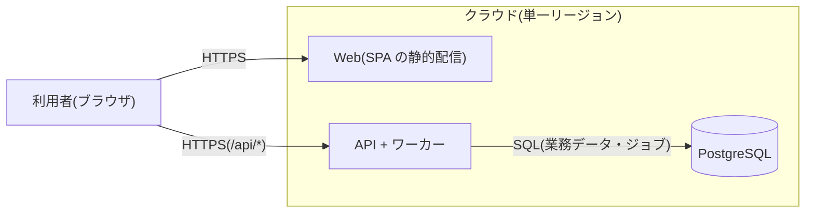

# システム構成設計(方針)

テンプレートが前提にしている構成をまとめる。業務の要件は `docs/requirements.md` を参照する。
プロジェクトに合わせて書き換えて使う。

## 1. 設計方針

小規模から始め、規模が要求した時点で強化する前提で、次の方針で構成する。

- **モジュラーモノリス構成**:単一のデプロイ単位に収めつつ、内部を明確な境界を持つモジュールに分割する。モジュール間の連携は各モジュールの公開インターフェース経由に限定し、他モジュールのテーブルを直接読み書きしない
- **ステートレスなアプリ層**:業務の状態はすべて DB に置き、アプリサーバーはいつでも増減・再起動できる状態を保つ
- **マネージドサービス優先**:シークレット管理・監視は自前運用せずマネージドを使う。運用者 1 人でも回る構成を最優先する
- **非同期処理は最小限のジョブテーブル方式**:専用のキュー基盤(SQS 等)は導入せず、DB のジョブテーブル+ワーカー(pg-boss)で開始する(4章)

## 2. システム構成図

## 3. モジュール構成

アプリケーション内部をモジュールに分割する。テンプレートにはサンプルとして `todo` モジュール(`todos` テーブルを所有)が 1 つあるだけで、
業務のモジュールは `apps/api/src/modules/` に足していく。境界の原則は次の 3 つ。

- **所有**:各モジュールは自分のテーブルのみを読み書きし、他モジュールの機能・データが必要な場合は公開インターフェース(facade)を呼び出す
- **依存の向き**:モジュール間の依存は一方向のみ許可し、双方向依存は禁止する(循環は dependency-cruiser が検出する)
- **調整役を 1 か所に置く(オーケストレーション)**:複数モジュールをまたぐ手順は、各モジュールのサービスに混ぜ込まず、調整役に集める。調整役だけが手順を知り、呼ばれる側は自分の仕事を公開 IF として提供するだけにする。調整役はその仕事を所有するモジュールの usecase に置き、ジョブハンドラ(worker)はそれを呼ぶ実行口に留める(worker の立ち位置は controller と同じ)。各モジュールがイベントに反応して連鎖するコレオグラフィではなく、調整役が順に呼ぶオーケストレーションを採る

  仕事を所有するモジュールが無い手順は、調整役だけを持つモジュールに置く(テーブルを持たず、呼ぶ順序だけを所有する)。

メールの送信(`platform/mail`、Resend)も同じく業務を持たない基盤で、送る口だけを提供する。文面・宛先・送る契機は仕事を所有するモジュールが決める。

ジョブの仕組み(`platform/job`)は業務を持たない汎用の実行基盤として切り出し、「キューに積む」「ハンドラを登録して実行する」ことだけを提供する。
どのキューにどのハンドラを登録するかは、その仕事を所有するモジュール側が決める。

モジュールを足したら、ここに依存の図(呼ぶ側 → 呼ばれる側)と次の 2 つの表を書き足していく。

### 3.1 モジュール定義

| モジュール | 責務 | 所有テーブル | 公開インターフェース(同期) |
| --- | --- | --- | --- |
| todo(サンプル) | todo の作成・一覧・完了・削除と、完了の通知(文面の組み立てと送信の依頼) | `todos` | (なし) |

整合性が必要な操作はモジュール境界で分割しない(1 つのトランザクションは 1 モジュールの中で完結させる)。

### 3.2 ジョブ一覧

| キュー | 登録元(タイミング) | 実行内容 | 失敗時 |
| --- | --- | --- | --- |
| `notify_completed_todo`(サンプル) | todo(完了を保存するトランザクション内) | 完了した todo を引き直し、gateway が文面を組み立てて `platform/mail` にメールの送信を頼む。通知までに削除されていれば何もしない | 最大 3 回リトライし、尽きたら error のログと Sentry に残す。完了そのものには影響させない |

ジョブの payload には対象を特定する値のみを入れ、実行時に最新のデータを引き直す(登録時点のスナップショットに依存しない)。

## 4. 非同期処理の方式(ジョブテーブル)

専用のキュー基盤(SQS・Redis 等)は導入せず、DB のテーブルをキューとして使う(pg-boss)。

- ジョブ登録はビジネス処理と同一トランザクションで INSERT する(`JobQueueService.enqueue` が現在の接続に相乗りする)。業務データとジョブ登録がアトミックになり、「処理したのにジョブがない」「ジョブだけあって処理がない」という不整合が構造的に起きない
- ワーカーは `FOR UPDATE SKIP LOCKED` でジョブを取得し、複数ワーカーでも二重実行しない。取得後にキューに応じたモジュールのハンドラを呼び出す
- 実行は冪等に実装する。トランザクションが保証するのは「積み忘れ・偽ジョブがない」ことまでで、実行時の失敗・再試行は別問題として扱う
- 失敗時はキューごとのリトライ方針(回数・バックオフ)で再試行する。上限到達時はログと Sentry に残し、後始末が要るならデッドレターのキューで受ける

流量が増えた場合はジョブテーブルを Outbox とみなして外部キューへ転送する構成に発展できる(登録側は無変更)。

## 5. コンポーネントと責務

| コンポーネント | 責務 |
| --- | --- |
| Web(Nuxt、SPA) | 画面の描画。API は OpenAPI から生成したクライアントで呼ぶ |
| API(NestJS) | API 提供(HTML は描画しない)、業務のトランザクション、ジョブ登録(pg-boss) |
| ワーカー | pg-boss のハンドラ。キューに応じてハンドラを呼び、ハンドラは調整役の usecase を呼ぶ。当面は API と同一プロセス |
| PostgreSQL | 各モジュール所有テーブル+ジョブテーブル |
| シークレット管理 | DB 接続情報などの秘密の値。コードやリポジトリには置かない |
| 監視・ログ基盤 | 構造化ログ(API は pino で JSON を stdout へ)、死活監視の `/api/health`。ログの集約先とアラームはデプロイ先に合わせて決める。エラー監視とトレースは Sentry |

## 6. 環境・デプロイ

- デプロイ単位:API とワーカー(pg-boss)は同一プロセスで動かす(ワーカーの分離は流量が要求した時点で行う)
- SPA(Nuxt)は静的ホスティングで配信し、API とは別デプロイとする
- DB マイグレーションはデプロイ手順に組み込み、expand-contract 方式で後方互換を保つ(`node dist/scripts/migrate`)
- API は TLS を終端するプロキシの後ろで動かし、web と同一オリジンで配信する(プロキシが `/api/*` だけを API に流す)。`/api/docs` と `/api/openapi.json` は開発者向けのため本番では配信しない
- デプロイ先とデプロイの手順はプロジェクトごとに決める。テンプレートが持つのは API の本番イメージ(`apps/api/Dockerfile`)まで
- AWS にデプロイする場合のリソースは `apps/infra` の CDK に書く。テンプレートの時点では空のスタック(`lib/stacks/app-stack.ts`)だけ

## 7. 技術選定

| 領域 | 選定 | 補足 |
| --- | --- | --- |
| フロントエンド | Vue / Nuxt(SPA モード)+ Nuxt UI | SPA としてビルドし、NestJS とは別に静的ホスティングで配信する |
| バックエンド | NestJS(TypeScript) | API 専用(HTML 描画なし)。モジュール境界(3章)は NestJS のモジュール機構で表現し、公開 IF はモジュールの `index.ts` に限定する |
| 入出力スキーマ | valibot(`packages/contracts`) | API の検証・OpenAPI・web の型を同じスキーマから得る |
| ORM | Drizzle | テーブル定義は `apps/api/src/db/schema.ts`。マイグレーションは drizzle-kit で生成する |
| ジョブ | pg-boss | PostgreSQL をキューとして使用(4章の方式をライブラリで実現)。ジョブ登録はビジネス処理と同一トランザクションで行い、リトライ・バックオフ・SKIP LOCKED による取得は pg-boss の機能を使う |
| DB | PostgreSQL | pg-boss のジョブテーブルも同一 DB に同居 |

SPA+API 分離に伴う考慮:API は CORS 設定(SPA 配信オリジンのみ許可)を行う。認証はテンプレートに含めていない。足す場合は署名付き Cookie
(SameSite=Lax, Secure, HttpOnly)のように、トークンを JS から触れる場所に置かない方式を選ぶ。
