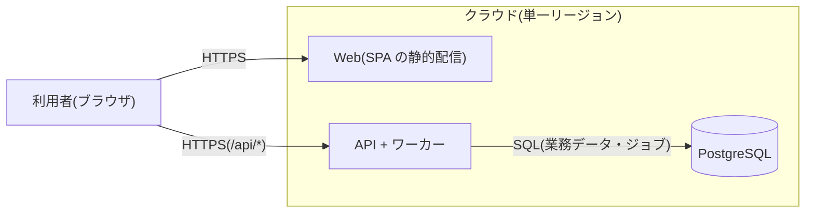

# システム構成設計(方針)

テンプレートが前提にしている構成をまとめる。プロジェクトに合わせて書き換えて使う。
業務の要件は `docs/requirements.md` を参照する。

## 1. 設計方針

小規模で始め、規模が大きくなって必要になった時点で強化する。そのために次の方針を採る。

- **モジュラーモノリス**:デプロイの単位は 1 つにし、内部を境界のはっきりしたモジュールに分ける。モジュール間の連携は各モジュールの公開インターフェース経由に限り、他モジュールのテーブルを直接読み書きしない(3章)
- **ステートレスなアプリ層**:業務の状態はすべて DB に置き、アプリサーバーをいつでも増減・再起動できるようにする
- **非同期処理はジョブテーブルで始める**:専用のキュー基盤(SQS・Redis 等)は導入せず、DB のジョブテーブルとワーカー(pg-boss)で処理する

## 2. システム構成図

## 3. モジュール構成

アプリケーションの内部をモジュールに分ける。テンプレートにあるのはサンプルの `todo` モジュール(`todos` テーブルを所有)だけで、
業務のモジュールは `apps/api/src/modules/` に足していく。境界の原則は次の 3 つ。

- **所有**:各モジュールは自分のテーブルだけを読み書きする。他モジュールの機能やデータが必要なときは、そのモジュールの公開インターフェース(facade)を呼ぶ
- **依存の向き**:モジュール間の依存は一方向だけにし、双方向の依存は禁止する(循環は dependency-cruiser が検出する)
- **オーケストレーション**:複数のモジュールをまたぐ手順は、各モジュールのサービスに分散させず、調整役 1 か所に集める。手順を知るのは調整役だけで、呼ばれる側は自分の仕事を公開インターフェースとして提供するだけにする。各モジュールがイベントに反応して連鎖する方式(コレオグラフィ)は採らない

調整役は、その仕事を所有するモジュールの usecase に置く。ジョブハンドラ(worker)は usecase を呼ぶ入口に留める(controller と同じ位置づけ)。
仕事を所有するモジュールが無い手順は、調整役だけを持つモジュールに置く(このモジュールはテーブルを持たず、呼ぶ順序だけを所有する)。

ジョブの仕組み(`platform/job`)とメールの送信(`platform/mail`、Resend)は、業務を持たない基盤として切り出している。

- `platform/job` が提供するのは「キューに積む」「ハンドラを登録して実行する」ことだけ。どのキューにどのハンドラを登録するかは、その仕事を所有するモジュールが決める
- `platform/mail` が提供するのは送る口だけ。文面・宛先・送る契機は、その仕事を所有するモジュールが決める

モジュールを足したら、ここに依存の図(呼ぶ側 → 呼ばれる側)を書き、次の 2 つの表に行を足す。

### 3.1 モジュール定義

| モジュール     | 責務                                                                    | 所有テーブル | 公開インターフェース(同期) |
| -------------- | ----------------------------------------------------------------------- | ------------ | -------------------------- |
| todo(サンプル) | todo の作成・一覧・完了・削除と、完了の通知(文面の組み立てと送信の依頼) | `todos`      | (なし)                     |

1 つのトランザクションは 1 つのモジュールの中で完結させる。整合性が必要な操作を、モジュールの境界で分けない。

### 3.2 ジョブ一覧

| キュー                            | 登録元(タイミング)                     | 実行内容                                                                                                                | 失敗時                                                                                         |
| --------------------------------- | -------------------------------------- | ----------------------------------------------------------------------------------------------------------------------- | ---------------------------------------------------------------------------------------------- |
| `notify_completed_todo`(サンプル) | todo(完了を保存するトランザクション内) | 完了した todo を引き直し、gateway が文面を組み立てて `platform/mail` に送信を頼む。通知までに削除されていれば何もしない | 最大 3 回リトライし、上限に達したら error のログと Sentry に残す。完了そのものには影響させない |

ジョブの payload には対象を特定する値だけを入れ、実行時に最新のデータを引き直す(登録時点のスナップショットに依存しない)。

## 4. 非同期処理の方式(ジョブテーブル)

DB のテーブルをキューとして使う(pg-boss)。

- ジョブは、業務の処理と同じトランザクションで登録する(`JobQueueService.enqueue` が現在の接続に相乗りする)。業務データの保存とジョブの登録は、一緒に確定するか一緒に取り消されるので、「処理したのにジョブがない」「ジョブだけあって処理がない」という不整合が起きない
- ワーカーは `FOR UPDATE SKIP LOCKED` でジョブを取得するので、複数のワーカーが同じジョブを同時に取得することはない。取得したら、キューに対応するモジュールのハンドラを呼ぶ
- ハンドラは冪等に実装する。トランザクションが保証するのは登録の時点の整合までで、実行は失敗して再試行されることがある
- 失敗したジョブは、キューごとのリトライ方針(回数・バックオフ)で再試行する。上限に達したらログと Sentry に残し、後始末が要るならデッドレターのキューで受ける

流量が増えたら、ジョブテーブルを Outbox とみなして外部のキューへ転送する構成に移れる。そのときも、登録する側のコードは変えずに済む。

## 5. コンポーネントと責務

| コンポーネント   | 責務                                                                                                                                                      |
| ---------------- | --------------------------------------------------------------------------------------------------------------------------------------------------------- |
| Web(Nuxt、SPA)   | 画面の描画。API は OpenAPI から生成したクライアントで呼ぶ                                                                                                 |
| API(NestJS)      | API の提供(HTML は描画しない)、業務のトランザクション、ジョブの登録                                                                                       |
| ワーカー         | pg-boss からジョブを取得し、キューに対応するハンドラを呼ぶ。ハンドラは調整役の usecase を呼ぶ。当面は API と同一プロセス                                  |
| PostgreSQL       | 各モジュールが所有するテーブルと、ジョブテーブル                                                                                                          |
| シークレット管理 | DB 接続情報などの秘密の値。コードやリポジトリには置かない                                                                                                 |
| 監視・ログ基盤   | 構造化ログ(API は pino で JSON を stdout へ)、死活監視の `/api/health`。エラー監視とトレースは Sentry。ログの集約先とアラームはデプロイ先に合わせて決める |

## 6. 環境・デプロイ

- API とワーカー(pg-boss)は同一プロセスで動かす。ワーカーを分けるのは、流量が増えて必要になった時点とする
- web(Nuxt の SPA)は静的ホスティングで配信し、API とは別にデプロイする
- API は TLS を終端するプロキシの後ろで動かす。プロキシが `/api/*` だけを API に流し、web と同一オリジンで配信する。`/api/docs` と `/api/openapi.json` は開発者向けなので、本番では配信しない
- DB マイグレーションはデプロイの手順に組み込む(`node dist/scripts/migrate`)。スキーマの変更は expand-contract 方式で行い、後方互換を保つ
- デプロイ先とデプロイの手順はプロジェクトごとに決める。テンプレートが持つのは API の本番イメージ(`apps/api/Dockerfile`)まで
- AWS にデプロイする場合のリソースは `apps/infra` の CDK に書く。テンプレートの時点では空のスタック(`lib/stacks/app-stack.ts`)だけ

## 7. 技術選定

| 領域           | 選定                            | 補足                                                                                                                                     |
| -------------- | ------------------------------- | ---------------------------------------------------------------------------------------------------------------------------------------- |
| フロントエンド | Vue / Nuxt(SPA モード)+ Nuxt UI | SPA としてビルドし、静的ホスティングで配信する(6章)                                                                                      |
| バックエンド   | NestJS(TypeScript)              | API 専用(HTML は描画しない)。モジュールの境界(3章)は NestJS のモジュール機構で表し、公開インターフェースはモジュールの `index.ts` に限る |
| 入出力スキーマ | valibot(`packages/contracts`)   | API の検証・OpenAPI・web の型を同じスキーマから得る                                                                                      |
| ORM            | Drizzle                         | テーブル定義は `apps/api/src/db/schema.ts`。マイグレーションは drizzle-kit で生成する                                                    |
| ジョブ         | pg-boss                         | 4章の方式を実現するライブラリ。リトライ・バックオフ・SKIP LOCKED による取得は pg-boss の機能を使う                                       |
| DB             | PostgreSQL                      | pg-boss のジョブテーブルも同じ DB に置く                                                                                                 |

本番では web と API を同一オリジンで配信するが、開発ではポートが違うので別オリジンになる。そのため API は、CORS で web のオリジン(`WEB_APP_ORIGIN`)だけを許可している。

認証はテンプレートに含めていない。足す場合は、署名付き Cookie(SameSite=Lax, Secure, HttpOnly)のように、トークンを JS から読めない場所に置く方式を選ぶ。
